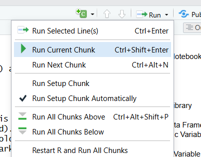
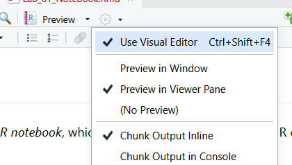
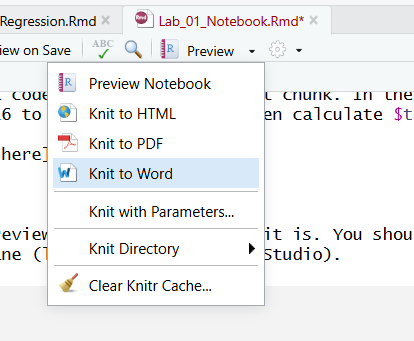
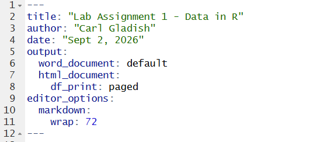
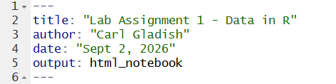
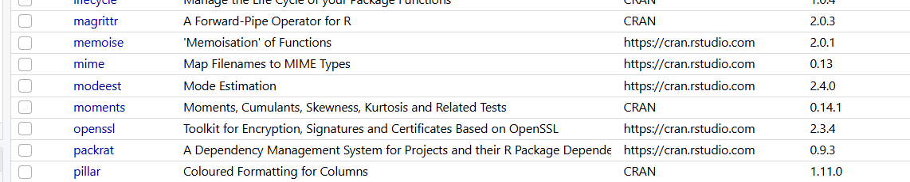
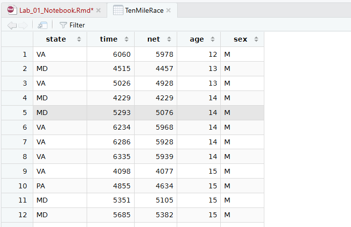
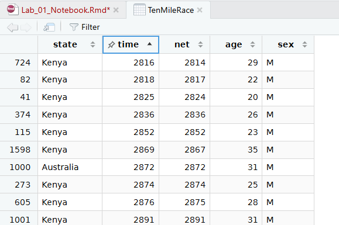
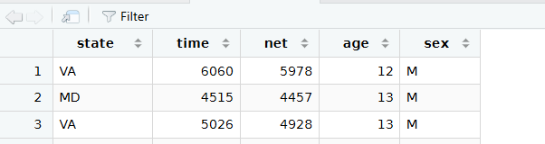

### What Is This?

This lab assignment contains some instructional material along with several tasks for you to complete using RStudio. At the end, you will find some "Pencil Problems" for you to practice solving problems by hand without R.

You should complete this lab to help prepare for upcoming quizzes and exams in this course. The lab assignment itself will *not* be collected for grading.

### Lab Objectives

The objectives of this lab assignment are for you to learn how:

- to write, preview, and knit an R notebook
- install and load an R library
- to explore a data frame in R
- to calculate sample statistics in R
- to calculate sample statistics "by hand" (using a calculator) and to understand their meaning

## 1. What is an R Notebook?

This document is an example of an *R notebook*. An R notebook is a mixture of written text and R code stored in a single file (extension .Rmd). It is written using a simple "markdown language". (For instance, you can create bold text like this: **stats is fun**.)

R Notebooks are a good way to organize your work, since it makes it easy to present your findings and to make sure your work is *reproducible* (since you can just re-run the entire notebook).

The words you are reading right now are part of a text *chunk*. An example of an R code chunk is below. To run the code, find the "Run Current Chunk" button

{width="227"}

or put the cursor anywhere inside the code chunk and use the CTL-SHIFT-ENTER shortcut.

```{r}
x <- 10
y <- 5
x+y
```

At any time, you can create a *preview* of an R notebook, which is a nice-looking HTML rendering of all the text and code (and output) in the notebook. It is a good idea to enable the *Preview in Viewer Pane* option before you click the *Preview* button.

{width="300"}

#### Task 1

Insert an R code chunk below this text. In the code chunk, assign the number 16 to a variable $t$ and then evaluate $t^2$.

```{r}
t = 16
t^2
```

#### Task 2

Create a preview of this notebook as it is. You should see the output in the *Viewer* pane (lower right pane of R Studio).

```{r}
2+2
```

Now run the code chunk above (with `2+2`) and then rerun Preview. You should see the new output appear in the preview. Previewing by itself does not force any code chunks to run.

#### Task 3

Let's say you are done creating this notebook. To create a presentable version of the notebook, you can *knit* it into several final formats, including: HTML, pdf, and Microsoft Word.

Your task is to knit the notebook into a Microsoft Word document using the drop-down menu next to "Preview" (or set the output format to WORD and use the CTL-SHIFT-k shortcut).

{width="291"}

You will see a new Word document with your notebook content. Note that **all** code chunks are automatically re-run before final rendering when you knit an R notebook.

After you knit the notebook, the output type in the notebook headers will have changed to "word_document" (as shown) and you will not see the Preview button anymore.

{width="371"}

To enable the Preview again, manually change the output type back (as shown):

{width="370"}

#### Task 4

There are two ways to type mathematical expressions in an R notebook text chunk. The first way--let's call it the *ugly* way--is just to type it out in regular text. For instance, here is a complicated expression written the ugly way.

sqrt(e\^-t - 17/2\* sin( 2/3 \* pi \* t) )

The second way--the *pretty* way--uses a separate markup language called "Latex". To use Latex mode, enclose your expression in dollar signs (\$) and follow Latex syntax.

Here is the above expression in Latex:

$\sqrt{e^{-t} - \frac{17}{2}\sin\left( \frac{2}{3}\pi t \right)}$

Some other examples of Latex:

- $1 + 2 = 3$

- $x^{-2t}$

- $x \in \mathcal{R} \cap \mathcal{T}$

- $\int_0^\infty \frac{1}{1+x^2}\,dx = \tan^{-1}(\infty) - \tan^{-1}(0) = \frac{\pi}{2}$

Latex expressions are rendered when you Preview or Knit your notebook.

Here is your task. Rewrite the ugly expression below in the pretty Latex format, then check that it looks right by previewing the notebook.

Ugly:

e\^(i*t) = (1 - 1/2!*t\^2 + 1/4!*t\^4 + ...) + i*(t - 1/3!*t\^3 + 1/5!*t\^5 + ...)

Pretty:

$e^{it} = \left(1 - \frac{1}{2!} t^2 \right)$

Note: You do **not** need to learn Latex for MATH 3042. The aim here is for you to have some idea why equations look like they do in an R notebook.

## 2. Loading an R library

You are going to load a library called `mosaic`. Inside that library is a data set called `TenMileRace` that we are going to examine.

But first, you may need to install an optional part of RStudio called *Rtools*. Follow this link and run the latest RTools installer.

<https://cran.rstudio.com/bin/windows/Rtools/>

You can visually check if the `mosaic` library is already installed on your computer by clicking the *Packages* tab and scrolling through the **User Library** list. My computer doesn't have it:

{width="650"}

To install `mosaic` run the code chunk below. The `require` check makes this safe to run multiple times.

```{r}
if (!require("mosaicData", quietly=TRUE)) {
  install.packages("mosaicData")
}
```

Now load the `mosaic` library and import the `TenMileRace` data frame.

```{r}
library(mosaicData)
data(TenMileRace)
```

#### Task 5

To practice what we just did for `mosaic`, write R code to check if your computer has the library `dplyr` installed. If not, then install it. Then load the `dplyr` library.

```{r}
if (!require("dplyr", quietly=TRUE)) {
  install.packages("dplyr")
}
library(dplyr)
```

We will use `dplyr` later in the lab.

## 3. Exploring a Data Frame

You can easily view the `TenMileRace` data frame by clicking the **Environment** tab and double-clicking on TenMileRace. You will see the data frame pop up.

{width="526"}

Try sorting the rows of the data frame by `time`. Just click on "time" once to get ascending order.

{width="424"}

The variable `time` is the time taken (in seconds) for an individual runner to complete the ten-mile Cherry Blossom Race in 2005.

{width="169"}

To find out more about this data set, open the help file by running `help(TenMileRace)`.

```{r, results='hide'}
  help(TenMileRace)
```

The help file explains where the data set comes from and what each variable (i.e., column) in the data frame represents. Note that `net` is described as:

> The recorded time (in seconds) from when the runner [crossed the starting line]{.underline} to when the runner [crossed the finish line]{.underline}.

For slower runners who started far back in the crowd, their `net` result better represents their race performance than the official `time` result.

We can confirm that their were 8636 runners by counting the number of rows in the data frame with `nrow`:

```{r}
nrow(TenMileRace)
```

Based on our quick look at the data, we can see that the race had 8636 runners and it was won by a 29-year old Male from Kenya, who finished the race in a time of $2816$ seconds (i.e., $46$ min $56$ seconds).

Now unsort the data frame by clicking the "time" header two more times until you see the rows in their original order:

{width="405"}

### Extracting Specific Variable Values

Suppose we want to pull out the `time` for the first runner in the data frame (who we can see in the previous image is a 12-year old Male from VA state). One way is to specify the row (1) and column (2) of that piece of data.

```{r}
TenMileRace[1, 2]
```

Another way is to use the *name* of the column:

```{r}
TenMileRace[1, "time"]
```

If we wanted to pull out the first five runner times, we could use:

```{r}
TenMileRace[c(1, 2, 3, 4, 5), "time"]
```

Side note: in R, we can specify a list of numbers using the `c()` function, as in

```{r}
c(3, 6, 8, 10)
```

Or, you can specify a list of consecutive numbers using the colon (:) notation.

```{r}
1:5
```

#### Task 6

Write an expression to return the `state` for the first 50 runners in the data frame.

```{r}

TenMileRace[1:50, "state"]
TenMileRace$state[1:50]

```

### Extracting Entire Variable

If you want to get the entire variable `time`, you can use the \$ syntax. This would give a very long output, so we will store the `time` values into a new variable called `race.times`.

```{r}
race.times <- TenMileRace$time
```

**R Note:** Variable assignment uses the "arrow" symbol `<-` in R. Also, R does *not* use the dot operator (`.`) the same way as C or Java or python. In R, the dot is often used in variable names.

This gives a new way to pull out the first five race times:

```{r}
race.times[1:5]
```

### Frequency Table

For non-numerical variables like `sex`, the possible values of the variable ("M" and "F") are called *levels* in R.

```{r}
levels(TenMileRace$sex)
```

The best way to summarize a non-numerical variable like `sex` is with a *frequency table*, which simply counts how many times each level occurs for that variable in the data set.

```{r}
table( TenMileRace$sex )
```

This shows that there were $4325$ female runners and $4311$ male runners in the race.

### Logical Arrays

It is often useful to check if a numerical variable satisfies a certain condition. This can generate an array of *Boolean* (i.e., logical) values.

```{r, results='hide'}
  TenMileRace$time < 3000
```

That generated a very long Boolean array. To see just the first few values use `head`.

```{r}
head(TenMileRace$time < 3000)
```

This shows that none of the first six runners had a time below 3000 seconds.

A Boolean array can be used to specify which rows to pull out of the data frame. The following returns the `time` values of all runners below 3000 seconds.

```{r}
TenMileRace[TenMileRace$time < 3000, "time" ]
```

Here is another way to get the same `time` values:

```{r}
TenMileRace$time[ TenMileRace$time < 3000 ]
```

To get the entire *row* of variables (not just the `time`) for those runners, we can omit the "time" in the second index position, and R will return a new data frame containing the entire rows for those runners. We will call this the "fast runners" subset.

```{r}
fast.runners <- TenMileRace[TenMileRace$time < 3000,  ]
fast.runners
```

How many fast runners are there? Recall that we can count the number of rows using `nrow`:

```{r}
nrow(fast.runners)
```

A direct way to count how many fast runners there are (with `time < 3000`) uses `sum`. This way works because False = 0 and True = 1.

```{r}
sum( TenMileRace$time < 3000)
```

#### Task 7

Write an expression that returns a data frame for all runner from the `state` of "Ethiopia".

```{r}
TenMileRace[TenMileRace$state=="Ethiopia", ]
```

#### Task 8

Write an R expression to return the `sex` of all "slow runners", meaning those with `net` time *larger* than 10,000 seconds. How many such runners are there?

```{r}
slowRunners = TenMileRace[TenMileRace$net>10000, "sex"]
slowRunners
length(slowRunners)
```

### Subsetting

Pulling rows out of data frame based on certain conditions is needed frequently. We can conveniently perform the same task using the `subset` function.

```{r}
slow.runners <- subset( TenMileRace, net > 10000 )
```

If there are multiple conditions, you can combine them using logical operations

- AND (`&)`

- OR (`|`)

- NOT (`!`)

For example, here is the data frame for all Female runners older than 65 who were not from Virginia (VA).

```{r}
subset(TenMileRace, (sex=="F") & (age>65) & !(state=="VA"))
```

#### Task 9

Use `subset` to write an R expression that returns all rows of `TenMileRace` with runners whose `net` is between 3000 seconds and 10000 seconds (including endpoints). Assign this to a variable `mid.runners`. Then write an expression to return the number of runners in this subset.

```{r}
mid.runners = subset(TenMileRace, net >= 3000 & net <= 100000)
length(mid.runners)
```

#### Task 10

Use `subset` to pull out the data frame containing all Female ("F") runners from Russia or Kenya.

```{r}
subset(TenMileRace, sex == "F" & (state == "Russia" | state =="Kenya"))
```

#### Task 11

Write R code to obtain the data frame of all runners who are *not* from the USA. How many such runners are there?

*Hint: the state codes for all USA runners are exactly two characters (like "VA"). Use `nchar(as.character(state))` to count the number of characters.*

```{r}
usa.runners = subset(TenMileRace, nchar(as.character(state))==2)
usa.runners
```

### Using `droplevels`

Suppose we want to select all the runners from the states of "VA", "MD", and "DC". We can do this using logical OR or using the `%in%` operator.

```{r}
#subset( TenMileRace, (state == "VA") | (state == "MD") | (state == "DC"))
```

```{r}
my.subset <- subset( TenMileRace, state %in% c("VA", "MD", "DC"))
```

Now suppose we make a frequency table for the `state` of `my.subset`. Strangely, the table contains *all* the original levels of `state` but with counts of 0.

```{r}
table(my.subset$state)
```

To force R to forget the old levels of `state` that are now empty, use the function `droplevels`.

```{r}
my.subset <- droplevels( my.subset )
table(my.subset$state)
```

#### Task 12

Use `subset` and `droplevels` and `table` to produce a frequency table showing the number of USA runners from each state. (The table should not show any other `state` categories.)

```{r}
usa.runners = subset(TenMileRace, nchar(as.character(state))==2)
usa.runners <- droplevels( usa.runners )
table(usa.runners$state)
```

#### Task 13

**Challenging** Use the function `which.max` (and other stuff) to print out which US state had the most runners. *Hint: help(which.max)*

```{r}
usa.runners = subset(TenMileRace, nchar(as.character(state))==2)
usa.runners <- droplevels( usa.runners )
most.runners.state = which.max(usa.runners$state[1])
usa.runners$state[most.runners.state]
```

## Filtering with `dplyr`

The library `dplyr` provides a useful function, `filter`, which is an alternative to the `subset` function. Make sure you have loaded the `dplyr` library.

```{r, results='hide'}
library(dplyr)
```

The function `filter` works like `subset` except you simply list the various conditions as separate arguments (no logical AND needed). For example, to get rows for Female runners from VA with net time below 4000 seconds, use

```{r}
filter(TenMileRace, sex == "F", state == "VA", net < 4000)
```

#### Task 14

Use `filter` to get a data frame containing all Male runners who are *not* from "VA" and *not* from "MD".

```{r}

```

## 4. Sample Statistics

For numerical variables like `net`, we typically calculate *sample statistics* to get a clearer understanding of the variable.

For example, to understand what a typical `net` time is for the Cherry Blossom Race, we calculate the *mean* and *median*.

```{r}
race.times <- TenMileRace$net 
mean( race.times )
median( race.times)
```

Note that these numbers are about 44 seconds different from each other. Either way, a typical `net` time is about 93 minutes (which is 5580 seconds).

We can also calculate the minimum and maximum race times use `min` and `max`.

```{r}
min( race.times ) 
max( race.times )
```

#### Task 15

Use `filter` and `mean` to calculate separately the average Male and Female `net` times.

```{r}
m.runners = subset(TenMileRace, sex == "M")
f.runners = subset(TenMileRace, sex == "F")

mean(m.runners$net)
mean(f.runners$net)

t.test(m.runners$net, f.runners$net)

```

#### Task 16

Calculate the mean `net` time of all local runners (meaning runners from the state "MD", "VA", or "DC") and all non-local runners.

On average, were local runners faster or slower than all other runners?

```{r}

```

#### Task 17

Write R code to count the number of Male runners who finished before the fastest Female runner (based on `time`, not `net`). Do not hard-code any literal numbers in your code!

```{r}

```

## Rank Statistic

The *rank* of an individual runner's `net` time is their *numerical position* (1st, 2nd, 3rd, ...) of finishing the race. If I finished first, then my rank is 1. In the case of a tie, more than one runner can get the same rank.

In this example, the first and third values are tied for 1st and the second and fifth values are tied for 3rd.

```{r}
rank( c(50, 200, 50, 400, 200, 700), ties.method="min")
```

In the Cherry Blossom Race, the first few runners in the data frame have ranks as shown.

```{r}
head(rank( TenMileRace$net, ties.method="min" ))
```

#### Task 18

Write R code to get the data frame containing the top 100 runners by rank (using `time`. Then calculate the mean `time` and the mean `net` for those runners.

```{r}

```

#### Task 19

Every runner's `net` time is either equal to or less than their `time` (gun time). Find the top 5 runners whose `net` time is the furthest below their `time`. Print those runner's `state`, `age`, and `sex`.

```{r}

```

### Histograms

The most important type of graph or chart to present a numerical variable $X$ is the *histogram*. It shows how many individuals had an $X$ value falling within a sequence of pre-determined "bins" or "classes".

For instance, all the `net` times in `TenMileRace` fall between 2800 and 10600. We can divide this into 78 classes as follows:

[2800, 2900),

[2900, 3000),

[3000, 3100),

...

[10400, 10500),

[10500, 10600)

The round brackets indicate that the right endpoint is *not* included in that class. We can then determine the frequency (i.e., count) of how many runners' `net` time falls into each class and then plot a vertical rectangle showing the frequency for each class. The result is a histogram of `net` times.

```{r}
hist( TenMileRace$net, breaks=seq(2800, 10600, by=100), right = FALSE,
      xlab="net (seconds)", 
      main="net times in Cherry Blossom Race (n = 8636)")

```

Using a class width of 200 instead of 100 creates a smoother shape with wider rectangles:

```{r}
hist( TenMileRace$net, breaks=seq(2800, 10600, by=200), right = FALSE,
      xlab="net (seconds)", 
      main="net times in Cherry Blossom Race (n = 8636)")

```

#### Task 20

Define the *usual* runners to be those runners who were *not* the slowest 5% and *not* the fastest 5% of runners (based on `net` time).

Use `filter` and `rank` to extract all the usual runners. Then generate a histogram with a class width of 300 seconds (i.e., 5 minutes) to present all the usual runners. Find out how to make the rectangles pink.

```{r}

```

# Pencil Problems

These problems are meant to be done with paper and pencil (and scientific calculator). They will help you prepare for the theory part of the quiz and the exams.

1.  To test new equipment for making ¾" plywood, 18 measurements of thickness $X$ were obtained. Calculate the mean, median, range, and standard deviation of $X$ based on the sample data. Measurements below are in inches.

    ::: {}
    |       |       |       |       |       |       |       |       |       |
    |-------|-------|-------|-------|-------|-------|-------|-------|-------|
    | 0.754 | 0.735 | 0.754 | 0.748 | 0.740 | 0.752 | 0.747 | 0.740 | 0.751 |
    | 0.741 | 0.740 | 0.742 | 0.748 | 0.732 | 0.750 | 0.747 | 0.750 | 0.752 |
    :::

2.  Calculate the mean and standard deviation of the diameter $X$ of steel rods from a sample of 350 rods.

    | **Diameter (mm)** | **Frequency** |
    |-------------------|---------------|
    | 10.00             | 40            |
    | 10.01             | 75            |
    | 10.02             | 100           |
    | 10.03             | 90            |
    | 10.04             | 45            |

3.  The daily opening price of gold (C\$ per oz) for the last ten days of Aug 2026 are given below.

    a.  Determine the typical price of gold over this time period. Provide more than one measure.

    b.  Calculate the standard deviation of gold Price based on the data given. What is the typical amount that the Price of gold deviates on any given day from its background value? (This is one measure of *volitility*.)

    c.  If gold Price is a normally distributed variable, then it is very unlikely to go outside three standard deviations above or below the mean Price. What are these upper and lower Prices, and what is the probability that the gold Price goes outside these limits just by chance?

        ::: {}
        | **Price of Gold (CA\$ per oz)** |
        |---------------------------------|
        | 6195.20                         |
        | 6377.58                         |
        | 6374.78                         |
        | 6448.51                         |
        | 6439.12                         |
        | 6343.34                         |
        | 6231.64                         |
        | 6244.87                         |
        | 6023.88                         |
        | 6127.91                         |
        :::

4.  Hank and Pete work in a fabrication facility. Records indicate that Hank completes an average of 62 items per shift, with a standard deviation of 4.2 items. Pete completes an average of 59 items per shift, with a standard deviation of 4.1 items. Which of the two would you consider to be the more consistent worker? Explain.

5.  Suppose a lumber mill ships 4x4’s with a mean moisture content of $\mu=18\%$ and $\sigma=0.5\%$. A histogram reveals that the data is bell-shaped.

    a.  Use Chebyshev's Rule to determine the minimum percentage of scores that lie between 17% and 19%.

    b.  Repeat question a. using the "Empirical Rule".

    c.  Use the Empirical Rule to estimate the percentage of values greater than 19.5%.

    d.  Use the Empirical Rule to estimate the percentage of values between 18% and 18.5%.

    e.  Building specifications require that the moisture content be under 19% to be closed in. Use the Empirical Rule to estimate the percentage of 4x4’s that are suitable to be closed in.

6.  Human body temperatures have a mean of $98.20 ^\circ F$ and a standard deviation of $0.62 ^\circ F$. Determine whether each of the following temperatures is usual or unusual:

    ::: {}
    |                   |                  |                  |
    |-------------------|------------------|------------------|
    | $101.00 ^\circ F$ | $96.90 ^\circ F$ | $96.98 ^\circ F$ |
    :::

7.  The two sets of sample data below (Site A and Site B) are measurements of the drainage rate of the soil in two different building sites (in $litre / m^2\cdot s$).

    a.  Based on relevant sample statistics, which of the sites has better drainage (higher and more consistent)? Conclude which site you would be more likely to recommend constructing a building on.
    b.  For Site B data set, assume that the drainage rates are known to be distributed in a bell-shaped curve. Could either (or both) the max and min values could be discounted as being too extreme?
    c.  If you were to exclude the minimum data point from the data set for site A, what would be the effect on the mean and the standard deviation?

    ::: {}
    | *Site A* | *Site B* |
    |----------|----------|
    | 2.99     | 1.02     |
    | 4.75     | 3.56     |
    | 8.79     | 3.5      |
    | 5.59     | 3.45     |
    | 2.32     | 4.5      |
    | 1.9      | 13.6     |
    |          | 4.5      |
    |          | 2.3      |
    |          | 3.5      |
    |          | 2.6      |
    |          | 3.31     |
    |          | 3.1      |
    :::
