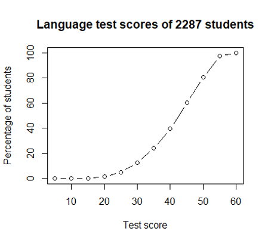

## Lab 2 - Descriptive Statistics

This lab assignment contains some instructional material along with several tasks for you to complete using RStudio. At the end, you will find some "Pencil Problems" for you to practice solving problems by hand without R.

You should complete this lab to help prepare for upcoming quizzes and exams in this course. The lab assignment itself will *not* be collected for grading.

### Lab Objectives

We are going to analyze data about student absences from school in New South Wales, Australia. This data can be found in the built-in dataset `quine`, which is part of the `MASS` library.

Packages required: `MASS`, `mosaic`, `dplyr`

The objectives of this lab assignment are for you to learn how to:

- calculate sample statistics of a variable $X$ in a data frame
- calculate sample statistics of a variable $X$ grouped by categories


#### Task 1

Load the required packages (listed above). Then load the required data frame `quine`.

```{r, include=FALSE}
# code here
```

Now examine the data visually in RStudio.
```{r}
View(quine)
```

### About `quine` Data Frame

Each row of `quine` represents one child who attended school in Walgett, New South Wales, Australia.

The main numerical variable in `quine` is `Days`, which is the number of days the student was absent from school.

The data set also contains categorical variables:

- `Sex` ("F" or "M")
- `Eth` (ethnic background: Aboriginal ("A") or Not ("N"))
- `Age` (age group form: "F0", "F1", "F2", "F3")
- `Lrn` (learner status: Average ("AL") or Slow ("SL"))

### Summary Statistics

The built-in function `summary()` provides six sample statistics for a numerical variable.

For example, using some made-up data for a variable $X$ we get:

```{r}
X.vals <- c(9, 10, 8, 10, 11, 12, 11, 11)
summary( X.vals )
```


#### Task 2

Use `summary()` and `sd()` to compute the summary statistics of `Days` listed in the table below. Record the results in the table.

```{r}
# code here
```

| Statistic | Value |
|:---------:|:-----:|
| $\bar{X}$ |       |
|    $s$    |       |
|    min    |       |
|   $Q_1$   |       |
|   $Q_2$   |       |
|   $Q_3$   |       |
|    max    |       |

### `mosaic` Functions for Grouped Data

The function `favstats()` from the `mosaic` library is similar to `summary()`, but it also shows the standard deviation. The syntax for calling `favstats()` is different.

```{r}
favstats(~Days, data=quine)
```

The first argument `~Days` is an example of a *model formula* in R. In this case, the model formula just says we want to use the `Days` variable.

This syntax becomes actually useful when we want to calculate sample statistics for various *groups* of individuals. For instance, we can group the students by learner type (`Lrn`). 

```{r}
favstats(Days~Lrn, data=quine)
```
This result shows that "slow" learners had a greater mean days absent (17.3 days) than "average" learners (15.8 days).

The `mosaic` package also overrides some built-in functions (listed below) so that they can use syntax as shown above for `favstats()`.

- `mean( ~X, data=data.frame)`
- `median( ~X, data=data.frame)`
- `sd( ~X, data=data.frame)`
- `var( ~X, data=data.frame)`
- `min( ~X, data=data.frame)`
- `max( ~X, data=data.frame)`
- `sum( ~X, data=data.frame)`
- `IQR( ~X, data=data.frame)`
- `quantile( ~X, data=data.frame)`
- `favstats( ~X, data=data.frame)`
- `histogram( ~X, data=data.frame)`
- `bwplot( ~X, data=data.frame)`

#### Task 3

Use the `mosaic` version of `mean()` to calculate the mean days absent for all students, grouped by `Sex`. Record the results in the table below.

```{r}

```


| Sex | $\bar{X}$ |
|:---:|:---------:|
|  F  |           |
|  M  |           |


#### Task 4

Using `mosaic` functions listed above, find Pearson’s coefficient of skewness ($Sk$) for `Days` using the entire sample of students. Then find $Sk$ for `Days` grouped by `Sex`. Fill in the table with your results.

Is either sex significantly skewed? How do the two groups compare in skewness? Write a one-sentence conclusion.

```{r}
# code here
```

|  Group  | $Sk$ |
|:-------:|:----:|
|   all   |      |
| Sex = F |      |
| Sex = M |      |


### Histograms

In Lab 1 we made a histogram for `TenMileRace` using `hist()` like this.

```{r}
data(TenMileRace)
hist( TenMileRace$net,
      breaks=seq(2800, 10600, by=200),
      right = FALSE,
      col="pink",
      xlab="net (seconds)", 
      main=paste0("Cherry Blossom Race (n = ",
                  nrow(TenMileRace), ")"))
```

The `mosaic` function `histogram()` is similar to the built-in function `hist()`. Here is the `mosaic` way to create the same chart.

```{r}
histogram( ~net, data=TenMileRace,
           type="count",
           breaks=seq(2800, 10600, by=200),
           right = FALSE,
           col="pink",
           xlab="net (seconds)", 
           main=paste0("Cherry Blossom Race (n = ",
                  nrow(TenMileRace), ")"))
```

#### Task 5

Use the `mosaic` version `histogram()` to create a histogram for the variable `Days`. You should:

- use classes of width 5 starting from zero
- include the value of $n$ (without hard-coding) in the title
- specify the colour using a hexdecimal RGB code for the color "coral" (find it here: <https://r-charts.com/colors/> )

How does the shape of the histogram reflect your calculated value of $Sk$? Write a one-sentence answer.

```{r}
# code here
```


### Box Plots

R has a built-in function `boxplot()`. For example, using the `net` variable in `TenMileRace` we get:

```{r}
boxplot( TenMileRace$net, horizontal = TRUE,
         xlab="net time (sec)",
         main="Cherry Blossom Race times")
```

#### Task 6

Your task is to use the `mosaic` version `bwplot()` to create a box plot for the `quine` variable `Days`. Label the X-axis appropriately and provide a title including $n$ (without hard-coding).

```{r}
#code here
```

#### Task 7

How many outliers are there for variable `Days`? Use an appropriate formula to determine "lower fence" and "upper fence" values to check.

```{r}
#code here
```

### Comparing Groups

We may be interested in comparing absences of students in different categories, for instance boys and girls. We can do this by computing statistics for `Days`, grouped by `Sex`.

```{r}
favstats(Days~Sex, data=quine)
```

Here we notice a few things:

- There were both boys and girls who had perfect attendance (zero days of absence).
- At each quartile ($Q_1$, $Q_2$, $Q_3$) boys had more absences than girls.
- However, the student with the most absences was female.

#### Task 8

Use `bwplot()` to create side-by-side box plots for the number of `Days` of absence, grouped by ethnicity (`Eth`). Also, use `favstats()` to compare sample statistics for `Days` grouped by `Eth`. Make two observations about how days of absence differ between the two groups.

```{r}
#code here
```


### Comparisons with Multiple Factors

We can also group data by multiple factors; for instance, we can find the mean number of absences, grouped by ethnicity (`Eth`) and `Sex`.

```{r}
mean(Days~Eth+Sex, data=quine)
```

#### Task 9

Use appropriate R code to determine which group of students, grouped by `Age` and `Sex`, is most *relatively* consistent with regards to absences, and which is least *relatively* consistent.

```{r}
#code here
```

### Percentiles

The `quantile()` function by default gives us the *quartiles* of a variable. For instance,

```{r}
 quantile(~Days, data=quine)
```

We can use `quantile()` to obtain any percentile values with the `probs=` argument. For instance, suppose we are interested in the 90th percentile of days absence.

```{r}
quantile(~Days, probs=0.9, data=quine)
```

We can also find multiple percentiles by listing them:

```{r}
quantile(~Days, probs=c(0.1, 0.9), data=quine)
```

```{r}
quantile(~Days, probs=seq(0.1,0.9, by=0.1), data=quine)
```

#### Task 10

Calculate the 20th, 40th, 60th, and 80th percentiles for `Days` of absence, grouped by learner status (`Lrn`).

```{r}
#code here
```

Note that learner status (`Lrn`) makes a fairly small difference to days absent at each of these percentile levels (i.e., 5 and 5 are identical).

Repeat the grouped percentile calculation just demonstrated, but grouping by `Sex`. Then do it again grouping by `Eth`. Is there one specific categorical variable (`Lrn`, `Sex`, or `Eth`) that leads to the greatest differences in `Days` at all of these percentile levels?

```{r}
#code here
```


### Percentile Rank

We have just found the variable value $X$ at given percentile levels. We can also go in the other direction: that is, given a variable value $X$, we can find its percentile rankings.

We use the `percent_rank()` function to do this. (This function is part of the `dplyr` package.) It is not a `mosaic` function, so its syntax is different.

```{r}
head( percent_rank(quine$Days) )
```

This tells us that the first value in the `Days` column represents the 8.965517th percentile level (i.e., it is larger than 8.97% of all `Days` values).

Percentile rankings are usually given as whole numbers, so format the output accordingly:

```{r}
head( round(100*percent_rank(quine$Days) ))
```

Again, this tells us that the first student in the data frame was absent more often than 9% of all students.

#### Task 11

Calculate the percentile rankings (rounded to the nearest percent) for the number of days absent for all students. Then print *only* those percentile rankings for male F0 students. Use `cbind()` to print your result as a vertical column.

```{r}
#code here
```

### Subset By Percentile Rank

Suppose we want to select all students `Days` above the 75th percentile. One way is:

```{r}
subset( quine, percent_rank(Days) > 0.75)
```

#### Task 12

Create a frequency table of the `Sex` of all students whose `Days` value is lower than the 25th percentile level. Which `Sex` is relatively more frequent in this quartile?

```{r}
#code here
```


### Z-scores, Chebyshev's Theorem, and the Empirical Rule

It is often useful to know a data value's $Z$-score (i.e., how many standard deviations that value is away from the mean). Like percentile rankings, $Z$-scores give a measure of how large or small a data value is relative to the other data values.

In R, the built-in function `scale()` provides $Z$-scores of all values in given vector. Applying this function to the `Days` column of our table shows, for instance, that the first student's days absent was 0.89 standard deviations below the mean.

```{r}
head( scale( quine$Days ) )
```

#### Task 13

Determine the number of students in the sample whose `Days` value was:

- at least 1 standard deviation away (above or below) from the mean
- at least 2 standard deviation away (above or below) from the mean
- at least 3 standard deviation away (above or below) from the mean

```{r}
#code here
```

#### Task 14

Confirm that your results from Task 12 satisfy Chebyshev's Theorem. But show that they *do not* satisfy the 68-95-99.7 rule (i.e., "Empirical Rule")? Explain why not with reference to answers to earlier questions.

```{r}
# code here
```


# Pencil Problems

These problems are meant to be done with paper and pencil (and scientific calculator). They will help you prepare for the theory part of the quiz and the exams.

1.  You are given the raw data for $X=$ the thickness (in inches) of plywood for a sample of $n=18$ sheets of nominally ¾" plywood. Determine an appropriate number of classes and appropriate class limits for a frequency distribution. Then determine the frequencies and the relative frequencies.

|       |       |       |       |       |       |       |       |       |
|-------|-------|-------|-------|-------|-------|-------|-------|-------|
| 0.754 | 0.735 | 0.754 | 0.748 | 0.740 | 0.752 | 0.747 | 0.740 | 0.751 |
| 0.741 | 0.740 | 0.742 | 0.748 | 0.732 | 0.750 | 0.747 | 0.750 | 0.752 |


2.  IQ scores for a large population have mean $\mu=100$ and standard deviation $\sigma=15$. Based on the 68-95-99.7 rule, determine the IQ score equivalent to:
  a.  $P_{2.5}$
  b.  $P_{16}$
  c.  $P_{50}$
  d.  $P_{66}$
  e.  $P_{97.5}$


3.  The price of gold for the last ten days of Aug 2026 are given below. 
 :::{}
        | **Price of Gold (CA\$ per oz)** |
        |---------------------------------|
        | 6195.20                         |
        | 6377.58                         |
        | 6374.78                         |
        | 6448.51                         |
        | 6439.12                         |
        | 6343.34                         |
        | 6231.64                         |
        | 6244.87                         |
        | 6023.88                         |
        | 6127.91                         |
        :::

a.  Determine the range $R$ and interquartile range $IQR$.
b.  Find the lower and upper "fence" for checking if a value is an *outlier*.
c.  Are there any outliers?


4.  The test scores of $2287$ Grade 8 students in the Netherlands are represented by the ogive below.
  
  

  a.  What proportion of students had scores below 50?
  b.  What proportion of students had scores between 30 and 40?
  c.  What range of scores represents the top 25% of the class?

