## Charts and Tables in R

This lab assignment contains some instructional material along with several tasks for you to complete using RStudio. At the end, you will find some "Pencil Problems" for you to practice solving problems by hand without R.

You should complete this lab to help prepare for upcoming quizzes and exams in this course. The lab assignment itself will *not* be collected for grading.

### Lab Objectives

The objectives of this lab assignment are for you to learn how to:

- generate pie charts and bar charts for categorical data
- generate stem plots, frequency distributions, histograms, and ogives for one numerical variable
- generate scatter plots for two numerical variables

### Packages required:

Before starting, load packages:

- `MASS`
- `lattice`
- `dplyr`

```{r, include=FALSE}
library(MASS)
library(lattice)
library(dplyr)
```

### Pie Charts in R

We will begin by making a pie chart. Pie charts are most useful for categorical data.

Here is our data:

> "At a local college, 10% of students live on campus, 30% live with their parents, 5% live alone, 35% live off-campus with roommates, and 20% live with a spouse."

We wish to present this data in a pie chart.

Go to the **Help** tab of the **Miscellaneous** window and search for "pie". Here is what R’s help file tells you about the function `pie()`:

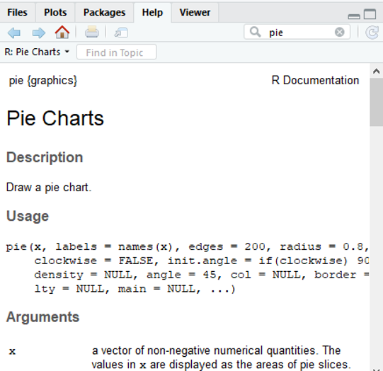{width="355"}

The first two arguments are the most important.

- `x` is a vector of non-negative numerical quantities. The values in are displayed as the areas of pie slices.

- `labels` is one or more expressions or character strings giving names for the slices.

Let's create a vector with the percentages given earlier and also a vector with the labels.

```{r}
percents <- c(10,30,5,35,20)
home.type <- c("On Campus","Parents","Alone", "Roommates", "Spouse")
```

Now we can create our pie chart.

```{r}
pie(percents, home.type)
```

#### Task 1

Read over the documentation for the `pie()` function and create the pie chart below. Ensure that you:

- include a title in the pie chart
- color names can be found here: <https://r-charts.com/colors/>

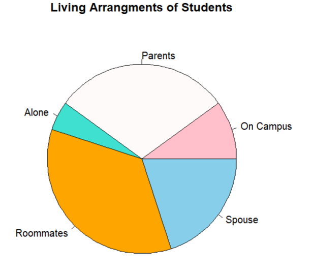{width="362"}

```{r}
# code here
percents <- c(10,30,5,35,20)
home.type <- c("On Campus","Parents","Alone", "Roommates", "Spouse")

pie(percents, home.type,
main="Living Arrangments of Students",
col=c("pink", "snow","turquoise", "orange", "skyblue"))
```

### Pie Charts Continued

We can also create pie charts from built-in data sets. In this example, we are going to use the data from the built-in data frame `survey` from the `MASS` library.

```{r}
data(survey)
View(survey)
```

To get just the first few rows of a data frame, use `head()`:

```{r}
head(survey)
```

Before going further, open the help-file to read about the `survey` data frame.

```{r}
help(survey)
```

Let’s create a pie chart for the variable `W.Hnd`, the student’s writing hand.

There are two possible values (i.e., two "levels") of `W.Hnd`. To see what they are, use:

```{r}
levels( survey$W.Hnd )
```

To generate a frequency table for `W.Hnd`, use:

```{r}
freq.tab <- table( survey$W.Hnd )
freq.tab
```

Now `freq.tab` is a "named" vector of length two. You can retrieve its names:

```{r}
names(freq.tab)
```

You can get its values using either numeric or named indices.

```{r}
freq.tab[1]
```

```{r}
freq.tab["Left"]
```

If you don't want to name to appear, you can index with double square brackets:

```{r}
freq.tab[["Left"]]
```

By default, R will use these names as the labels if we make a pie chart:

```{r}
pie(freq.tab)
```

Suppose we want to edit the labels to include the number of students in each category. We can create new labels using the function `paste0()` like this:

```{r}
new.labels <- paste0(names(freq.tab), "\n(", freq.tab,")")
new.labels
```

Use the new labels to create a better pie chart:

```{r}
pie( freq.tab, new.labels)
```

#### Task 2

Create the following pie chart. Use code to compose the title; do not hard-code the value after $n=$.

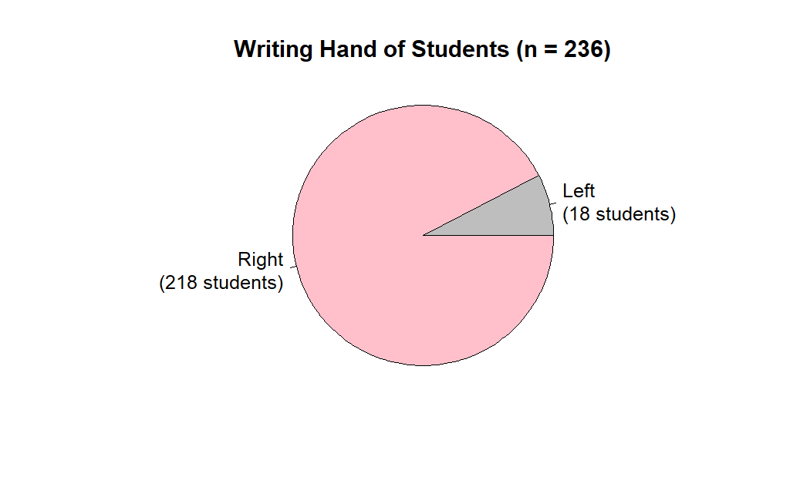{width="552"}

```{r}
freq.tab <- table( survey$W.Hnd )
new.labels <- paste0(names(freq.tab), "\n(", freq.tab,")")
pie( freq.tab, new.labels)
```

### Bar Charts

Alternatively, we can create a *bar graph* to represent the writing hands of the students. The following command uses the same table you used to create your pie chart.

```{r}
barplot(freq.tab)
```

#### Task 3

Read the documentation for `barplot()` and produce the following chart.

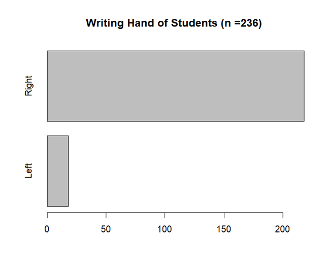{width="467"}

```{r}
#code here
```

### Stem Plots in R

For numerical data, other kinds of charts are preferable.

First, we are going to create a stem plot for the students' heights. We only need one variable for our stem plot – the `Height`. Extract it and view the first few values using:

```{r}
head(survey$Height)
```

We can use `cbind()` to get the data as a column:

```{r}
head(cbind(survey$Height))
```

Create a default stem-leaf plot of heights using:

```{r}
stem(survey$Height)
```

Note that the first row contains heights between 150 cm and 154 cm. The second row contains heights between 155 cm and 159 cm.

Read the help-file for `stem()` to see how you can customize your stem plot.

#### Task 4

Produce the following stem plot.

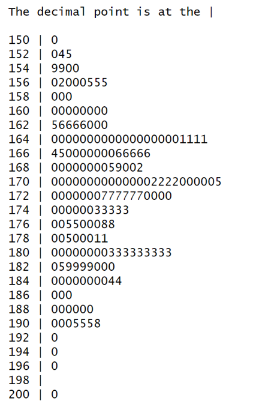{width="304"}

```{r}
#code here
```

### Frequency distributions in R

Stem plots are quick and easy, but they have serious limitations. (For example, what if we had thousands of data values?) It is useful to condense the raw data into a frequency table.

We will make a frequency table for the `survey$Height` data using classes of width 5 cm. Start by getting the range of the data

```{r}
range(survey$Height)
```

Unfortunately, that result is unusable since `Height` contains NA values. To ignore NA values, use:

```{r}
numerical.heights <- survey$Height[ !is.na(survey$Height) ]
```

Now we can get the range:

```{r}
range(numerical.heights)
```

This tells us that the shortest student is 150 cm tall and the tallest is 200 cm tall. We will cut the interval [150, 200] every 5 cm:

```{r}
lower.limits <- seq(150, 200, by=5)
```

We can now assign a class to each numerical height. (Here right=FALSE says that the *next* lower limit is not included in the current interval.)

```{r}
heights.classes = cut(numerical.heights, 
                      lower.limits,
                      right=FALSE)
head(heights.classes, 20)
```

A frequency table for the height classes shows how many students were in each sub-interval (i.e., each class).

```{r}
heights.freq = table(heights.classes)
cbind(heights.freq)
```

#### Task 5

Using the`survey`data, create two frequency tables: one for the `Height` of Male students and one for the `Height` of Female students.

Choose a reasonable number of classes and use the same class limits for both groups. Generate frequency tables for the two groups separately. Make an observation about any differences you can see between the two groups.

```{r}
#code here
```

Female heights are noticably smaller than male heights. The standard deviation appears to be similar.

### Histograms in R

We can also display the `Height` data from `survey` in histogram form:

```{r}
hist(numerical.heights) 
```

There are a few things to note:

- The bins are each of width 5. This might not be what we want.

- The label for the x-axis and the title are inadequate.

#### Task 6

Read the help-file for `hist()`. Produce the following histogram. Ensure that you get the correct:

- title (without hard-coding the $n$)
- axis labels
- bin width and lower limits
- rectangle colour

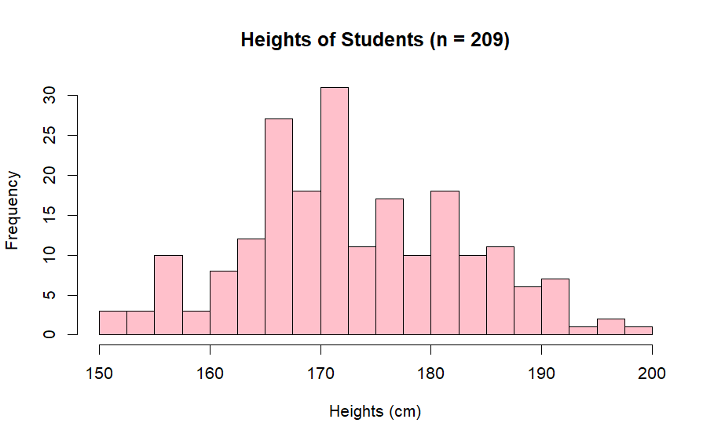

```{r}
#code here
```

### Cumulative frequency tables in R

Sometimes we are interested in the cumulative frequencies of data. For instance, we might want to know how many students are $\lt 175 \,\textrm{cm}$ in height. We can create a *cumulative* frequency table based on the classes we defined earlier.

```{r}
heights.classes = cut(numerical.heights, 
                      lower.limits,
                      right=FALSE)

heights.freq = table(heights.classes)

cumul.freq <- cumsum(heights.freq)

cbind( cumul.freq )
```

Here, we can see that 126 students are $\lt 175 \,\textrm{cm}$ in height.

### Ogives in R

We can represent the cumulative frequencies in an *ogive* by plotting the cumulative frequencies against the heights. The `plot()` function allows us to do this. Try using `plot()`:

```{r}
x.vals <- seq(0, 2*pi, 0.1)
y.vals <- sin(x.vals)
plot(x.vals, y.vals, col="blue")
```

To plot an *ogive* for student heights, we will use `plot()` with:

- lower class limits as $x$ coordinates

- cumulative frequency as $y$ coordinates

But we need to insert a $0$ at the beginning of `cumul.freq` to reflect that fact that *no* data points are below the first lower limit.

```{r}
cumul.freq <- c(0, cumul.freq)
```

Now plot:

```{r}
plot(lower.limits, cumul.freq, col="red")
```

#### Task 7

Read the help file for `plot()` and create the following ogive. Make sure your plot has lines connecting the points.

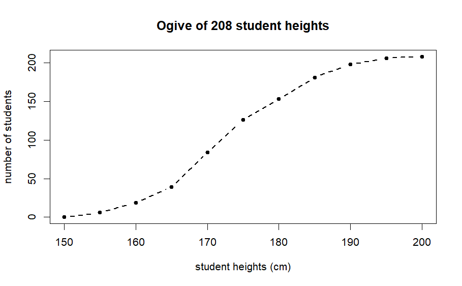

```{r}
#code here
```

### Scatterplots in R

Scatter plots help to visualize the relationship between two numerical variables. For example, we can see how height and weight are correlated. In general, we expect a tall person to weigh more than a short person – but of course there are exceptions. (We say there is a *positive correlation* between height and weight, but not a perfect correlation.)

To look for a relationship between the variables `Height` and `Wr.Hnd` (which gives the span of the student’s writing hand), make the *scatterplot* as follows:

```{r}
xyplot(Wr.Hnd ~ Height, data=survey,
       col="black")
```

The points form a very spread out "cloud", which indicates there is not much correlation between the two variables.

#### Task 8

Read the help-file for `xyplot()` and then generate the following scatter plots based on the `survey` data. Which pair of variables has a stronger linear correlation? (Calculate $r$ for each pair to double check your answer.)

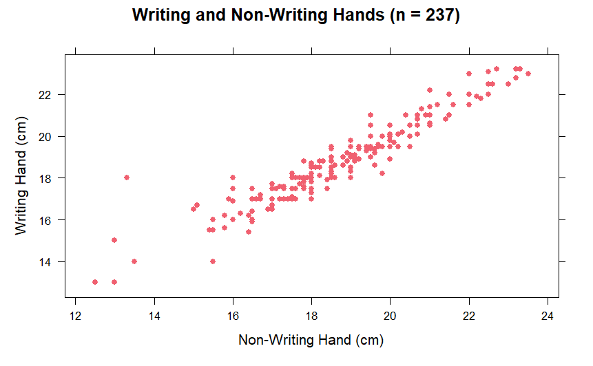

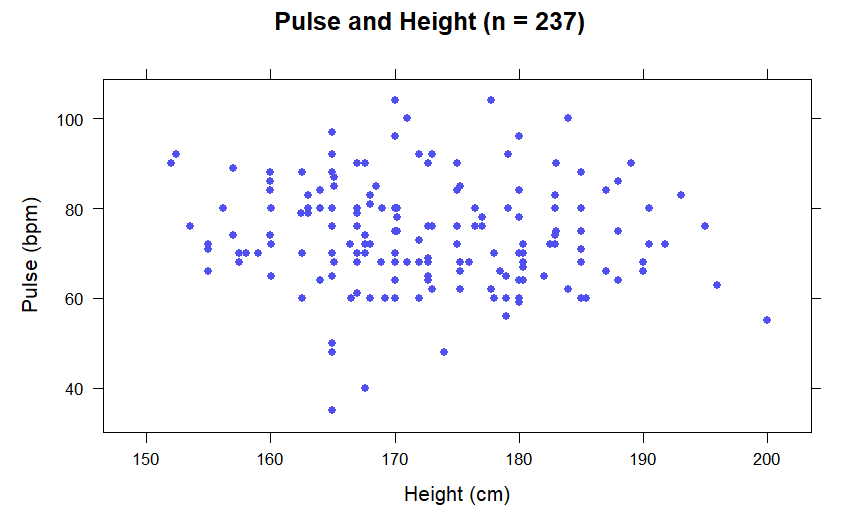

```{r}
#code here
```

## Pencil Problems

These problems are meant to be done with paper and pencil (and scientific calculator). They will help you prepare for the theory part of the quiz and the exams.

1.  The following summary statistics describe a numerical variable $X$. Determine an appropriate number of classes and class width to create a histogram for $X$.

    | $n$       | $250$  |
    |-----------|--------|
    | $\bar{X}$ | 100.07 |
    | $s$       | 14.66  |
    | min       | 51.3   |
    | $Q_1$     | 89.8   |
    | $Q_2$     | 100.8  |
    | $Q_3$     | 109.7  |
    | max       | 135.4  |

2.  To test new equipment for making ¾" plywood, measurements of thickness, $X$, were recorded below (in inches).

    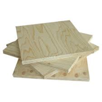{width="102"}

|       |       |       |       |       |       |       |       |       |
|-------|-------|-------|-------|-------|-------|-------|-------|-------|
| 0.754 | 0.735 | 0.754 | 0.748 | 0.740 | 0.752 | 0.747 | 0.740 | 0.751 |
| 0.741 | 0.740 | 0.742 | 0.748 | 0.732 | 0.750 | 0.747 | 0.750 | 0.752 |

Create a frequency table with five classes.

| Class Limits | Frequency | Rel. Frequency |
|:------------:|:---------:|:--------------:|
|    ? - ?     |           |                |
|    ? - ?     |           |                |
|    ? - ?     |           |                |
|    ? - ?     |           |                |
|    ? - ?     |           |                |
|    ? - ?     |           |                |

3.  The test scores of 2287 Grade 8 students in the Netherlands are represented by the ogive below.

<!-- -->

a.  What proportion of students had scores below 50?
b.  What proportion of students had scores between 30 and 40?
c.  What range of scores represents the top 25% of the class?

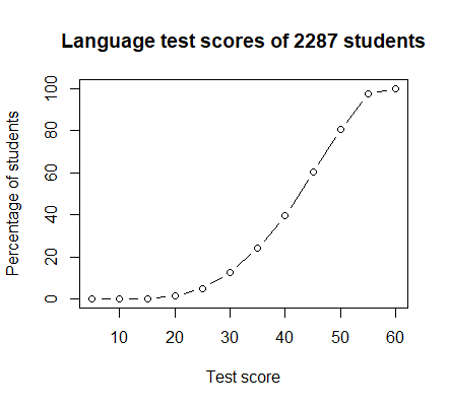

4.  The times between Old Faithful eruptions, in minutes, are given in the stem plot below.

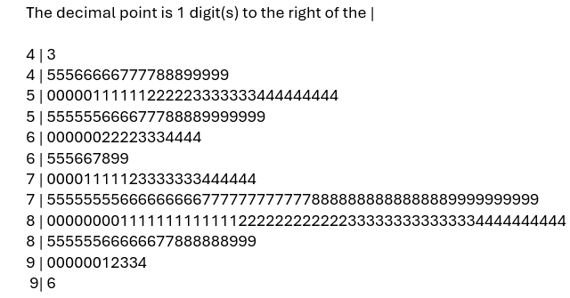

a.  What is the range of the data?
b.  Describe the distribution of the data.
c.  Which 10-minute range contains the largest number of waiting times between eruptions?

<!-- -->

5.  The heights of 237 statistics students are represented in the boxplot below. Complete the sentence below to make one observation about the relative heights of male and female students.

> "x% of female students are shorter than…"

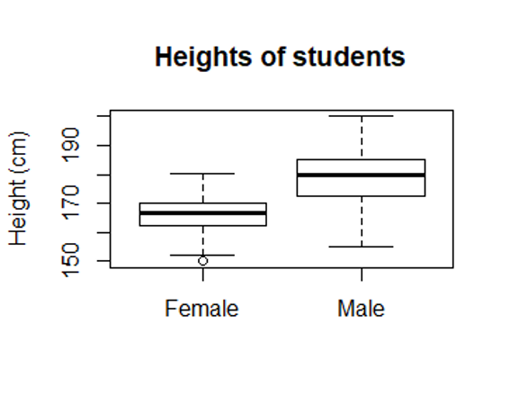
