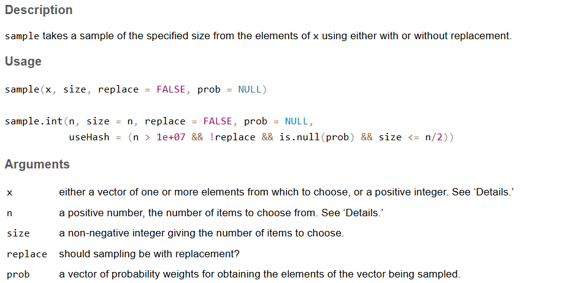
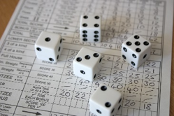
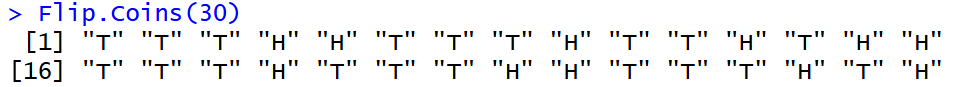
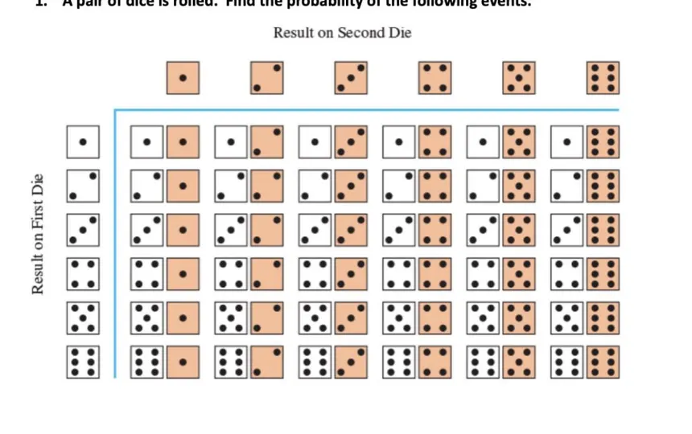

## Probability Simulations

This lab assignment contains some instructional material along with several tasks for you to complete using RStudio. At the end, you will find some "Pencil Problems" for you to practice solving problems by hand without R.

You should complete this lab to help prepare for upcoming quizzes and exams in this course. The lab assignment itself will *not* be collected for grading.

### Lab Objectives

The objectives of this lab assignment are for you to learn how to:

- use `sample()` to simulate random experiments
- calculate "relative frequency" probabilities based on simulated data
- create graphs to visualize the distribution of a random variable, $X$

### Packages required:

Before starting, load packages:

- `mosaic`

```{r, include=FALSE}
library(mosaic)
```

------------------------------------------------------------------------

### Using `sample()` to Simulate Random Experiments

In this lab, we are going to simulate random experiments and estimate the probability of an event $E$ based on the results.

We will simulate our random experiments using the built-in function `sample()`. The helpfile says:



------------------------------------------------------------------------

#### Simulated Dice Rolls

For instance, the following simulates rolling one "fair" six-sided die.

```{r}
sample( c(1,2,3,4,5,6), 1)
```

Since the sample space is the integers $1,2,3,4,5,6$, we could accomplish the same thing by using:

```{r}
sample.int(6, 1)
```



To simulate rolling five fair six-sided die, we need to say `replace=TRUE`.

```{r}
sample.int(6, 5, replace=TRUE)
```

Without `replace=TRUE`, the five values will be *distinct* every time, which is not how independent die actually work.

For instance, here are three simulations *without replacement*. (You never get the same die value twice.)

```{r}
sample.int(6, 5)
sample.int(6, 5)
sample.int(6, 5)
```

What if the die is "loaded", meaning one side is more likely to come up than the others? You can specify the probabilities of each value using the `prop=` argument.

For instance, here are $100$ dice rolls where the die are loaded to come up $6$ with $50\%$ probability.

```{r}
sample.int(6, 100, replace=TRUE,
           prob = c(0.1, 0.1, 0.1, 0.1, 0.1, 0.5))
```

Let's say we are interested in the variable $X=$ the number of times you get a $6$ out of $100$ dice rolls. For fair die, we can perform one simulation of $X$ using:

```{r}
die.outcomes <- sample.int(6, 100, replace=TRUE)
X <- sum( die.outcomes == 6)
print(X)
```

------------------------------------------------------------------------

#### Flipping Coins

When you flip a coin, there are two possible outcomes:

- *heads*, which we will denote "H"
- *tails*, which we will denote "T"

A *fair* coin is one where *heads* and *tails* both have $50\%$ probability.

To simulate flipping one fair coin, we can do:

```{r}
sample(c("H","T"), 1)
```

#### Task 1

Write an R command to simulate flipping $10$ fair coins.

```{r}
sample(c("H", "T"), 10, replace = TRUE)
```

#### Task 2

Write an R command to simulate flipping $1000$ fair coins where there is a $55\%$ chance of getting *heads*. Print the value of the variable $X=$ the number of *heads* that turn up.

```{r}
coin.tosses = sample(c("H", "T"), 1000, replace = TRUE, prob = c(0.55, 0.45))
length(subset(coin.tosses, coin.tosses == "H"))
```

------------------------------------------------------------------------

### Writing Functions in R

To produce efficient code, you need to be able to write a *function* in R. You can define a function anywhere in your code *before* it is called. Here is a simple function:

```{r}
myfunc <- function(x) {
  return(x^2)
}
```

You can call this function just like any other R function:

```{r}
myfunc(4)
```

#### Task 3

Write a function called `pick.a.number` that takes an integer `n` as input and returns a random integer between `1` and `n` (inclusive). Test your function by calling `pick.a.number(100)` several times.

```{r}

pick.a.number = function(n){
  return(sample(n, 1))
}

pick.a.number(100)

```

#### Task 4

Write a function called `Flip.Once` that simulates flipping one fair coin. It does not take any inputs, and it returns either "H" or "T" (randomly). Test your function by calling `Flip.Once()` five times.

```{r}
Flip.Once = function(){
  return( sample(c("H", "T"),1))
}

Flip.Once()
```

------------------------------------------------------------------------

### `for`-loops in R

The syntax for a basic `for` loop in R is as follows:

```{r}
for (i in 1:10){
  print(i)
}
```

The index variable (`i` in the previous example) can run over any list-like object. For instance:

```{r}
my.list <- list( name="Carl",
                 age=46,
                 sex="M",
                 job="instructor",
                 eye.color="brown",
                 height.cm=189)

for (v in my.list){
  print(v)
}

```

To simulate multiple trials of a random experiment, we can use a `for` loop and store the results in an array. For instance, here we simulate 100 trials where each trial consists of rolling one fair die.

```{r}
die.results <- numeric(100) #initialize an array of 100 numbers

for (i in 1:100){
  die.results[i] <- sample.int(6, 1)
}

die.results
```

#### Task 5

Write a function called `Flip.Coins` that takes `n` as input and simulates `n` trials of flipping one fair coin. The function `Flip.Coins` should use a `for` loop where `Flip.Once()` is called to simulate each individual coin flip.

`Flip.Coins` returns an array of `character` values. For instance, here is an example showing one such call:

{width="608"}

```{r}
Flip.Coins = function(n){
  results = character(n)
  
  for(i in 1:n){
    results[i] = Flip.Once()
  }
  
  return( results)
}

Flip.Coins(100)
```

### Simulating Probabilities

Suppose we are interested in a random experiment where event $E$ can either occur on not. (Remember that $E$ might consist of one *or more* specific outcomes of the experiment.)

If we simulate an experiment $m$ times and event $E$ occurs $k$ times, then we estimate the probability to be:

$$P(E)\approx \frac{k}{m}$$

#### Task 6

Here you will write a function to estimate the probability of getting *heads* for a fair coin. (The exact value is $50\%$, but pretend you don't know that.)

Write a function `Prob.Heads` that simulates flipping one coin for a given number of trials, `m`. Use a `for` loop for the trials. Then determine $k=$ the number of *successful* trials (where the coin was *heads*). Your function should then return the value $\frac{k}{m}$.

Confirm that `Prob.Heads` is working properly by called `Prob.Heads(10^5)`. The result should be very close to $0.5$.

```{r}
Prob.Heads = function(m){
  
  results = character(m)
  for(i in 1:m){
    results[i] = Flip.Once()
  }
  
  successful = subset(results, results == "H")
  return(length(successful) / m)
}

Prob.Heads(10*5)
```

#### Task 7

Now suppose we roll two fair dice. Let $X=$ the *sum* of the two die. The event $E$ we are interested in is defined by the result: $X=7$.

We are going to determine the probability of the event $E$.

Write a function `Prob.E` that simulates $m$ trials of the random experiment (rolling two fair dice). Internally, the function determines $k$, the number of *successful* trials in which $E$ occurs. It then returns the result $\frac{k}{m}$.

Run your function `Prob.E` with `m = 10^5` to get a fairly accurate probability.

(As a "pencil problem", you should determine the *exact* probability of getting $X=7$ when you roll two die.)

```{r}
Prob.E = function(m, e){
  results = numeric(m)
  
  for(i in 1:m){

    results[i] = sum(sample(6, 2, replace = TRUE))
  }
  
  successful = subset(results, results == e)
  return(length(successful)/m)
}

Prob.E(10^5, 7)
```

### Using `replicate()`

The `for`-loops we have used so far all have something in common. The body of the `for`-loop does not use the index variable `i` (except to store the result in an external array).

In other words, each iteration performs essentially the *same* thing. For this kind of `for`-loop, there is an alternative approach that uses the function `replicate()`.

For instance, here is a `for`-loop that does not use the index variable `i` except to store the result in an array:

```{r}
res <- numeric(10)
for (i in 1:10){
  res[i] <- sample.int(100, 1)
}
res
```

You can achieve the same result using:

```{r}
res <- replicate(10, sample.int(100, 1))
res
```

#### Task 8

Use `replicate()` to rewrite the functions `Prob.Heads` and `Prob.E` (from the previous tasks) so that they *do not* use `for`-loops. Test both functions using `m=10^5`.

```{r}
Prob.E = function(m, e){
  results = replicate(m, sum(sample(6, 2, replace = TRUE)))

  successful = subset(results, results == e)
  return(length(successful)/m)
}

Prob.Heads = function(m){
  
  results = replicate(m, Flip.Once())
  
  successful = subset(results, results == "H")
  return(length(successful) / m)
}

Prob.Heads(10*5)

Prob.E(10^5, 7)
```

#### Task 9

You should have noticed that the simulated probabilities above are never *exactly* equal to the theoretical value. Instead, they exhibit random variability.

An interesting question is: how does the amount of variability in our estimate of $P(\textrm{H})$ depend on the number of coins/trials, $m$?

We are going to run `Prob.Heads(m)` 1000 times for each value of `m` in the table below. Using the 1000 estimates of $P(\textrm{H})$, we will calculate the sample standard deviation $s$ to measure the variability. Write code to do all this, then fill in the table.

You should as much as possible use `replicate()` rather than `for`-loops. (Using `for`-loops will likely slow down the code execution too much.)

What happens to the variability in the estimated $P(\textrm{H})$ as $m$ increases?

```{r}

ms = c(10^{1:5})
s = numeric(length(ms))
r.reps = 100

for(i in 1:length(ms)){
  m = ms[i]
  Prob.E.Ests = replicate(r.reps, Prob.Heads(m))
  s[i] = sd(Prob.E.Ests)
  cat(paste0("m = ", m, ", s = ", s[i], "\n"))
}


```

| $m$ (trials) | $s$ for $100$ estimates of $P(\textrm{H})$ |
|:------------:|:------------------------------------------:|
|      10      |                   -                   |
|     100      |                   -                   |
|     1000     |                   -                   |
|    10000     |                   -                   |
|    100000    |                   -                   |

------------------------------------------------------------------------

### Dice Rolling

Let's go back to dice rolling.

Suppose we roll a die $m=20$ times, and we get the values 

$$6, 1, 4, 2, 2, 2, 4, 4, 1, 4, 2, 3, 3, 3, 3, 2, 6, 2, 4, 5$$ 

We could obtain a *frequency distribution* for this data set using:

```{r}
die.vals <- c(6, 1, 4, 2, 2, 2, 4, 4, 1, 4,
              2, 3, 3, 3, 3, 2, 6, 2, 4, 5)
table(die.vals)
```

Since we are interested in probabilities, we can obtain *relative* frequencies using:

```{r}
prop.table(table(die.vals))
```

We can visualize this using a bar plot:

```{r}
barplot(prop.table(table(die.vals)), col="lightgreen",
         xlab="X = die value", ylab="rel. freq.")

```

#### Task 10

Write a function `Roll.Dice(m)` that simulates rolling a die `m` times and then creates a bar plot like the one above showing the *relative* frequency distribution of outcomes.

The title of your bar plot should be "Simulated Die Rolls (<m> Trials)", where <m> is the actual value of `m` you entered. (Use `paste0()` to concatenate strings). Make the bars light blue and label the axes.

Run your function for `m` $=100$, $1000$, and $10000$. Looking at the three graphs, what is happening as `m` increases?

```{r}
Roll.Dice = function(m){
  results = replicate(m, sample(6, 1))
  
  
  
  barplot(prop.table(table(results)), col="lightblue", main=(paste0("Simulated Die Rolls (", m, " Trials)")),
         xlab="X = die value", ylab="rel. freq.")
}

Roll.Dice(100)
Roll.Dice(1000)
Roll.Dice(10000)
```

Answer: 

------------------------------------------------------------------------

### Rolling `n` Dice

Now the random experiment is "roll $n$ dice". Since each die has $6$ options, the number of outcomes for this experiment is $6^n$. For example, with two dice there are $36$ outcomes.



For each random experiment of rolling $n$ die, we can determine the variable

$$X = \textrm{ the number of times 3 turns up}$$

For instance, if $n=5$ and the die outcomes are $2,3,3,5,1$ then $X=2$.

#### Task 11

Write a function called `Roll.Some.Dice(m, n)` that simulates `m` trials of the experiment in which you roll `n` dice at once. Let $X=$ the number of dice showing 3. 

Your function `Roll.Some.Dice` must output a table that shows the *relative* frequency distribution of $X$ based on the `m` trials. Your function must also output a barplot showing the *relative* frequency distribution of $X$. 

The title of each plot should be "Number of 3s Out of \<n\> Dice (Based on \<m\> Trials)", where \<m\> and \<n\> are the actual values entered. Label your axes appropriately. 

Run `Roll.Some.Dice(m, n)` with `m= 10 000` for each of the following:
	
- `n = 1` (i.e., roll a single die)
- `n = 2` (i.e., roll 2 dice)
- `n = 5`
- `n = 10`
- `n = 100`

Examine all five bar plots. What is happening as `n` increases? Explain in a sentence or two.

```{r}
Roll.Some.Dice = function(m,n){
  X.vals <- replicate(m, sum(sample.int(6, n, replace=TRUE)==3))
  X.tab <- table(X.vals)
  
  X.tab
barplot(X.tab, col = ("pink"), xlab="X = # 3s", ylab="Frequency", main = paste0("Number of 3s Out of ", n, " Dice (Based on ", m," Trials)"))
}

Roll.Some.Dice(10^4, 100)
```

Answer:

-----

### Drawing Cards

A standard deck of playing cards contains $52$ cards made up of:

- $13$ red "hearts" (with values: 2, 3, 4, 5, 6, 7, 8, 9, 10, J, Q, K, A)
- $13$ red "diamonds" (same values)
- $13$ black "clubs" (same values)
- $13$ black "spades" (same values)

For the experiments in this section, we will simulate sampling *without replacement*, since that is normally how cards are drawn from a deck.

Throughout this section, the random variable we are using is:

$$ X = \textrm{the number of red cards drawn}$$

#### Task 12

Write a function `Draw.Cards(m, n, replace)` that simulates drawing `n` cards from a 52-card deck. The argument `replace` must be `TRUE` or `FALSE`, indicating whether the cards are drawn with replacement or not. The experiment is performed a total of `m` times. 

For each trial, $X = \textrm{the number of red cards drawn}$.

(You must decide for yourself how to model the deck of 52 cards in the call to `sample()`.)

Your function `Draw.Cards` must create a mosaic-style `histogram()` based on the `m` values of $X$ obtained.  Use the option `type="d"`. Label the axes appropriately and give an informative title that does not hard-code any numbers.

* Run `Draw.Cards` for $m=10000$ and $n=1, 5, 10, 20, 50$ and `replace=TRUE`.
* Run `Draw.Cards` for $m=10000$ and $n=1, 5, 10, 20, 50$ and `replace=FALSE`.

Examine all ten histograms. Answer the questions:

- What happens as $n$ increases?
- What consistent relationship is there between the `replace=TRUE` graphs and the corresponding `replace=FALSE` graphs?

```{r}
library(lattice)

Draw.Cards = function(m, n, replace, col){
deck <- c(rep("R", 26), rep("B", 26))
X.vals <- replicate(m, sum(sample(deck, n, replace) == "R"))
  
  histogram(X.vals, col = col, type="d", breaks=seq(-0.5, n+0.5, by=1), xlab="X = # red cards", ylab="Prob. Density", main=paste0("Number of Red Cards Out of ",n, " Cards (", m, " Trials)"))
}

Draw.Cards(10^4, 1, TRUE, col="pink")
```

Answers: 


## Pencil Problems


These problems are meant to be done with paper and pencil (and scientific calculator). They will help you prepare for the theory part of the quiz and the exams.

This week, the "Pencil Problems" are posted separately as a pdf file.
